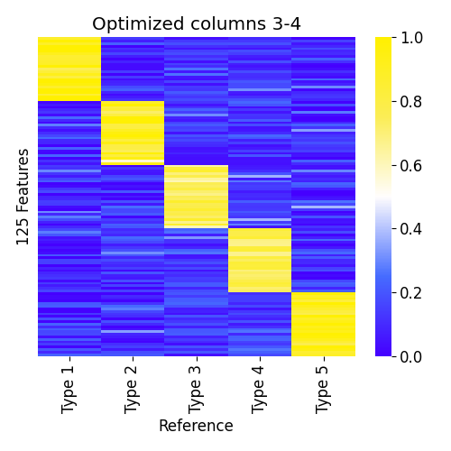

# ssNMF - semi-supervised non-negative matrix factorization tool
`ssNMF` is a semi-supervised / constrained non-negative matrix factorization tool.
It performs NMF, NNLS (non-negative least squares), or combination of the two methods. 
It is designed to cope with biological deconvolution problems.

## Introduction 
### Problem settings
There is a set of observed samples, `data`, represented by vectors of numbers in range `[0,1]`. 
The samples are assumed to be approximately linear combinations of a reference set of samples, `atlas`. 
The main purpose is to find the `weights` / coefficients of these combinations. 
The atlas may be unknown, and inferred together with the weights. 
This setting is a classic NMF problem. 

On the other hand, the atlas may be completely known in advanced, and used directly to find the coefficients. 
This case is solved with the classic NNLS (non-negative least squares) linear regression. 
In between there are other - semi-supervised - scenarios: 
only some of the atlas columns are unknown and to be inferred; 
some of columns are approximated in beforehand and are to be adjusted. 
This flexible tool solves this spectrum of problems. 

<p align='center'>
    
</p>
<p align='center'>
    <em>Illustration of matrix factorization </em>
</p>

## Examples
We simulate 5 different reference samples (`atlas`) with 125 features, 
25 specificaly high in each of the 5 reference samples.
We mixed 200 samples (`data`) with different rates of the reference samples.

#### Case 1 - the atlas is known beforehand (NNLS problem).
The true linear combination is illustrated bellow.
<p align='center'>
    
</p>
<p align='center'>
    <em>Visualization of the simulated data</em>
</p>

Running `ssNMF.py` in this case to estimate the mixing coefficients of the first 20 samples:
```bash
python3 ssNMF.py --atlas atlas.csv --data samples.N20.csv -p example1
# outputs weights as a csv file named example1.coef.csv
# to plot it:
python3 plot_deconv.py example1.coef.csv --outpath example1.coef.pdf
```

<p align='center'>
    
</p>
<p align='center'>
    <em>Predicted composition</em>
</p>

#### Case 2 - the atlas is unknown (NMF problem).
For this case we run `ssNMF.py` without input atlas (`--atlas`). The number of columns must be specified (`--nmf_cols`)
```bash
python3 ssNMF.py --nmf_cols 5 --data samples.csv -p example2
# outputs both weights and predicted atlas
# plot predicted atlas:
python3 plot_atlas.py example2.atlas.csv -o example2.atlas.png
```
<p align='center'>
    
</p>
<p align='center'>
    <em>Predicted atlas by NMF</em>
</p>

Note that while the restored reference samples are similar to the true 
reference samples, their order is different. 
We used the Hungarian/ Munkers method to reorder them for visualization purposes.

#### Case 3 - Partial uncertanity
Now for the semi-supervised part. Let's say we have a reference atlas, 
but we have low confidence of some of the reference samples. 
We can ask `ssNMF.py` to optimize them while fixing the other columns.

```bash
python3 ssNMF.py --atlas atlas.csv --data samples.csv -p example3 --optimize 3-4
# or equivalently:
python3 ssNMF.py --atlas atlas.csv --data samples.csv -p example3 --fix 1-2,5
```

<p align='center'>
    
</p>
<p align='center'>
    <em>Predicted atlas when optimizing columns 3-4</em>
</p>

#### Case 4 - Partially missing reference data
A key drawback of the NNLS method for deconvolution is the assumption 
that the reference data is complete.
With `ssNMF.py` we can assume partial data, 
and ask the algorithm to learn the missing reference samples.
In our example, let's say we don't have the fifth reference sample, 
Megakaryocytes, and ask `ssNMF.py` to infer it.

```bash
# add another "unknown" column to the reference atlas (--add 1)
python3 ssNMF.py --atlas atlas.4cols.csv --data samples.csv -p example4 --add 1
```

<p align='center'>
    
</p>
<p align='center'>
    <em>Predicted atlas when inferring column </em>
</p>


## Quick start

```bash
# Clone
$ git clone https://github.com/nloyfer/ssNMF.git
$ cd ssNMF
# run with all columns fixed
$ python3 ssNMF.py --atlas examples/atlas.csv --data examples/ex1/samples.N20.csv -p example1 [-v]
RMSE: 0.5864542840929288

dumped example1.atlas.csv
dumped example1.coef.csv

# Plot deconvolution results:
$ python3 plot_deconv.py example1.coef.csv --outpath example1.coef.pdf

# plot atlas:
$ python3 plot_atlas.py example1.atlas.csv -o example1.atlas.pdf
```

### Notes about the input / usage
The input `data` (csv) contains the observed samples as columns in a csv file. 
The first column must be a feature/index column, and the first line must be header/titles.
The input `atlas`, if specified, must follow the same format, 
and share the same features (first column) as the `data` csv file.


This project is developed in [Prof. Tommy Kaplan's lab](https://www.cs.huji.ac.il/~tommy/) at the Hebrew University, Jerusalem, Israel.

