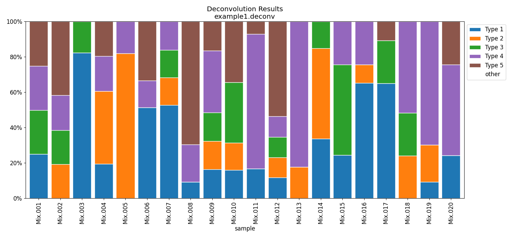

ssNMF project
# ssNMF - semi-supervised non-negative matrix factorization tool
`ssNMF` is a semi-supervised / constrained non-negative matrix factorization (NMF) tool.
It performs NMF, non-negative least squares, or combination of the two methods. 
It is designed to cope with biological deconvolution problems.

## Introduction 
### Problem settings
There is a set of observed samples, `data`, represented by vectors of numbers in range `[0,1]`. 
The samples are assumed to be approximately linear combinations of a reference set of samples, `atlas`. 
The main purpose is to find the `weights` / coefficients of these combinations. 
The atlas may be unknown, and inferred together with the weights. 
This setting is a classic NMF problem. 

On the other hand, the atlas may be completely known in advanced, and used directly to find the coefficients. 
This case is solved with the classic NNLS (non-negative least squares) linear regression. 
In between there are other - semi-supervised - scenarios: 
only some of the atlas columns are unknown and to be inferred; 
some of columns are approximated in beforehand and are to be adjusted. 
This flexible tools solves this spectrum of problems. 

<p align='center'>
    
</p>
<p align='center'>
    <em>Illustration of matrix factorization </em>
</p>

## Examples
We simulate 5 different reference samples (`atlas`) with 125 features, 
25 specificaly high in each of the 5 reference samples.
We mixed 200 samples (`data`) with different rates of the reference samples.

#### Case 1 - the atlas is known beforehand (NNLS problem).
The true linear combination is illustrated bellow.
<p align='center'>
    
</p>
<p align='center'>
    <em>Visualization of the simulated data</em>
</p>
Running ssNMF.py in this case to estimate the mixing coefficients of the first 20 samples:
```bash
python3 ssNMF.py --atlas atlas.csv -i samples.N20.csv -p example1
```
<p align='center'>
    
</p>
<p align='center'>
    <em>Predicted composition</em>
</p>

#### Case 2 - the atlas is unknown (NMF problem).

#### Case 3 - One missing column

#### Case 4 - One uncertain column

The input `data` (csv) contains the observed samples as columns in a csv file. 
The first column must be a feature/index column, and the first line must be header/titles.

For the first case, we assume we know the `atlas` table. It should be a csv file with the same format as the `data`.
a reference table/atlas (csv), with columns representing the reference samples

## Quick start
### Installation

```bash
# Clone
git clone https://github.com/nloyfer/ssNMF.git
cd ssNMF
```


